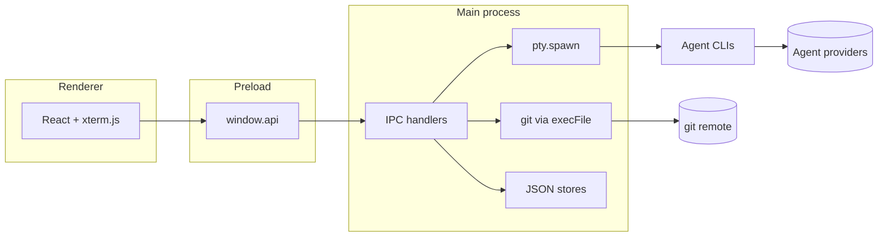

# AI Worktrees

A local macOS app for running several AI coding agents at once — each in its own git worktree or in a shared code folder. Open a session, talk to the agent in the main terminal, drop to a shell or Git panel when you need to, switch sessions without losing context, and pick up where you left off after a restart.

Built-in agents: [Claude Code](https://claude.com/claude-code), Cursor Agent, Gemini CLI, and Codex CLI. The registry is data-driven; see [AGENTS-README.md](./AGENTS-README.md) to add another.

---

## Install

Release builds are produced from `main` in GitHub Actions. After copying the app to `/Applications`, macOS may quarantine a downloaded build:

```sh
xattr -rd com.apple.quarantine "/Applications/AI Worktrees.app"
```

---

## Your first five minutes

**1. Point the app at your code.**  
Open **Settings → General** and set the code directory (default `~/code`). The app scans that folder for git repositories when you create a repo-scoped session.

**2. Create a session.**  
Click **+ New Session** in the sidebar (or press **Shift+C**). The wizard has three steps:

- **Type** — repo worktree (new branch + worktree) or **global** (agent runs at the code directory, no git worktree)
- **Agent** — pick a CLI; unavailable agents are greyed out if the binary is not on your `PATH`
- **Details** — session name (also the branch name for repo sessions), optional labels

**3. Start the agent.**  
Select the session in the sidebar. The main pane is an xterm.js terminal running the agent CLI in that session’s directory. Agent history stays on disk in the agent’s own config. **Repo sessions** resume when saved state exists for that session’s worktree path. **Global sessions** run at your code directory (shell, git, and agent all use that path); each global session gets its own agent config directory under app data (`CLAUDE_CONFIG_DIR`, `CURSOR_CONFIG_DIR`, `CODEX_HOME`) so conversations stay separate across relaunches. **Deleting** a session (or recreating one with the same name) clears that session’s saved agent conversations so the agent starts fresh.

**4. Open the bottom dock when you need more.**  
Each session remembers its own panel layout:

- **Shell** (**Shift+T**) — fish when available, otherwise your login shell, at the session directory
- **Git** (**Shift+G**) — status, diffs, stage, unstage, discard for that worktree

**5. Move between sessions.**  
**Shift+N** cycles every non-muted session in sidebar order. **Shift+J** cycles focus between the agent terminal, shell panel (when open), and the skills bar. **Shift+↓** jumps to the bottom of the agent terminal. Muted sessions are skipped when cycling; mute from the speaker icon on a session card or the context menu.

**6. Run a skill.**  
The bottom bar has a slash-command prompt (left side). Type `/` to pick a skill — e.g. `/Summarise Session` — press **Enter** to lock it in, add any extra text, then **Enter** again to send it to the active agent. Press **Esc** or click **×** to clear the field. Manage skills in **Settings → Skills**; they work across Claude, Cursor, Gemini, and Codex sessions.

That’s the core loop: sidebar for orientation, agent terminal for work, dock for shell and git, skills bar for reusable prompts, keyboard shortcuts for speed.

---

## Layout

```
┌ Sidebar ──────────────┬─ Main pane ────────────────────────┐
│ Sessions by activity  │ Agent terminal (xterm.js)          │
│ Labels, mute, delete  │                                    │
│ Settings, Agent Data, Cleanup ├─ Bottom dock (optional, per session)│
│                       │ Shell │ Git                        │
├───────────────────────┴─ Skills bar ──────────── To Do ────┤
│ Type /skill-name …    (full width, except To Do button)    │
└────────────────────────────────────────────────────────────┘
```

- **Sidebar** — session cards grouped by Working / Idle / Stopped; labels always visible; drag the right edge to resize.
- **Main pane** — one agent terminal per opened session; only the active session is visible, but PTYs stay alive in the background.
- **Bottom dock** — resizable; terminal and git visibility are stored per session in local storage.
- **Skills bar** — slash-command prompt for cross-agent skills; spans the bottom bar except the To Do button.
- **To Do** — global task list (not tied to git); open from the bottom-right button.

---

## Features

| Area | What you get |
| --- | --- |
| **Sessions** | Repo worktrees (`git worktree add`) or global sessions at the code directory |
| **Agents** | Claude, Cursor, Gemini, Codex — concurrent sessions can use different agents |
| **Terminals** | Long-lived agent PTY + optional built-in shell PTY per session |
| **Git panel** | Status, diff, stage / unstage / discard for the active worktree |
| **Labels** | Color labels on sessions and to-do items; filter to-do by label and date |
| **Mute** | De-emphasise sessions; skipped by **Shift+N** |
| **To Do** | To Do / Doing / Done sections; inline editing; drag between sections |
| **Skills** | Cross-agent slash-command prompts in the bottom bar; edit in Settings → Skills; import/export with other settings |
| **Agent Data** | Edit each agent’s instructions file; billing / usage hints where supported |
| **Cleanup** | Sidebar modal to list and remove leftover branches, worktrees, and agent session data (grouped by repo, Global, or External) |
| **Settings** | Code directory, theme, skills, labels, keyboard shortcut reference, import/export |
| **Persistence** | Sessions, settings, and to-do survive restarts; worktrees remain on disk until you delete |
| **Session delete** | Removes the session record; repo sessions can remove the worktree and branch; clears saved agent conversations (Claude, Cursor, Codex) for that path |

On first launch the app may install **Git**, **GitHub CLI** (`gh`), and **fish** via Homebrew when missing, and can open Terminal for `gh auth login`. These are optional conveniences for your environment — the app does not call the GitHub API for features inside the UI today.

---

## Keyboard shortcuts

Full list in **Settings → Shortcuts**. Shortcuts work from the main workspace, including while focus is in a terminal (but not while typing in a form field).

| Shortcut | Action |
| --- | --- |
| **Shift+N** | Next session in sidebar (skips muted) |
| **Shift+T** | Toggle shell panel for the active session |
| **Shift+G** | Toggle git panel for the active session |
| **Shift+J** | Cycle focus: agent terminal → shell (when open) → skills bar |
| **Shift+↓** | Scroll to bottom of the active session agent terminal |
| **Shift+V** | Open active session in VS Code |
| **Shift+F** | Reveal active session in Finder |
| **Shift+C** | New session |

Toolbar buttons in the main pane header mirror the shell, git, VS Code, and Finder actions.

---

## Requirements

- macOS
- Agent CLIs on your `PATH` for whichever agents you use (`claude`, `cursor-agent`, `gemini`, `codex`, …)
- A folder of git repos (default `~/code`, configurable in Settings)
- Node.js 20+ and npm — development and packaging only; not required for the packaged `.app`

Optional: **fish** (preferred for the built-in shell; may be installed automatically), **gh** and **git** (may be installed or configured at startup).

---

## Development

```sh
npm install      # also rebuilds node-pty for Electron
npm run dev      # Electron with HMR
npm run typecheck
npm run test     # agent launch command tests
```

If node-pty fails to load after a Node version change: `npm run rebuild`.

## Build

```sh
npm run dist     # release/AI Worktrees.dmg + .app
```

---

## Where things live

| What | Where |
| --- | --- |
| App data (dev) | `~/Library/Application Support/ai-worktrees/` |
| App data (packaged) | `~/Library/Application Support/AI Worktrees/` |
| Legacy migration | Older `Claude Worktrees/` or `claude-worktrees-ui/` folders are copied once if the new directory is empty (`src/main/migrate.ts`) |
| `sessions.json` | Session list — paths, agent, labels, global flag, … |
| `settings.json` | Code directory, theme, session labels, worktrees skills |
| `diary.json` | To-do items |
| Global agent data | `userData/global-agent-data/<session-id>/` — per-session `CLAUDE_CONFIG_DIR`, `CURSOR_CONFIG_DIR`, and `CODEX_HOME` for global sessions |
| Global session symlinks (legacy) | `userData/global-sessions/<session-id>` — old symlink-based isolation; removed on delete; agent data cleared if present |
| Worktrees | Sibling of the repo: `<parent>/<repo-name>-<session-name>` (slashes in the name become dashes) |
| Agent session data | Per-project dirs under each agent’s home (e.g. `~/.claude/projects/…`, `~/.cursor/projects/…`, `~/.codex/sessions/…`); global sessions use per-session dirs under `global-agent-data/` instead; cleared on session delete/create and via **Cleanup → Agent Sessions** |
| Panel prefs | Browser `localStorage` key `session-panel-prefs` (per-session shell/git open state) |

Only sessions you create in the app appear in the sidebar. The app does not import or discover agent processes running outside it.

---

## Security

AI Worktrees is **local-first**: no telemetry, no in-app auto-update, and **no HTTP client** in this repository’s TypeScript. Network access happens only when **subprocesses you run through the app** use the network — the same trust boundary as Terminal.

### Trust model

You should treat the app as **fully trusted on your machine**. It can spawn shells, run `git`, read your code directory, write JSON under Application Support, and read agent instruction files in your home directory.



### What runs at runtime

| Action | What it touches |
| --- | --- |
| List repos | Directories under your code directory; `git rev-parse` per candidate |
| Create repo session | Optional `git fetch`; `git worktree add` with a new branch |
| Create global session | No git mutation; `ensureGlobalAgentStorage` creates per-session agent config dirs; each session has a unique id/name |
| Agent terminal | `pty.spawn` login shell with launch command from `agents.ts`; cwd probe decides resume (repo: worktree path; global: code directory + per-session agent config env) |
| Built-in shell | Separate `pty.spawn` per session; fish preferred when installed |
| Git panel | `git status` / `diff` / `add` / `restore` via `execFile` in the worktree |
| Persist state | `sessions.json`, `settings.json`, `diary.json` in userData |
| Delete repo session | `git worktree remove`; optional branch delete; clears agent session data for that worktree |
| Delete global session | Removes `global-agent-data/<session-id>/` and any legacy symlink; clears agent session data for that session |
| Cleanup modal | Lists leftover branches, worktrees, and agent session folders; selective or bulk delete |
| Agent instructions | Read/write under each agent’s home (e.g. `~/.claude/CLAUDE.md`) |
| Claude usage chip | May run pinned `ccusage` via `npx` / `bun x` (local usage files; npm when uncached) |
| Startup setup | May install `git`, `gh`, or fish via Homebrew; may launch Terminal for `gh auth login` |
| Open in VS Code | `code --reuse-window` via `execFile` |
| Reveal in Finder | `shell.openPath` on the session directory |

### Network

| Source | Uses network? |
| --- | --- |
| App TypeScript/JavaScript | **No** — no `fetch`, `http`, `axios`, etc. in `src/` |
| `git fetch` / remotes | **Yes** — your git credentials |
| Agent CLIs | **Yes** — same as running them in Terminal |
| `gh` install / auth | **Yes** — when setup runs or you sign in |
| Homebrew (optional installs) | **Yes** — if automatic install runs |
| `npx ccusage@…` | **Yes** — npm registry when the package is not cached |

### Hardening

- `contextIsolation: true`, `nodeIntegration: false` — renderer cannot call Node directly.
- `sandbox: false` — required for node-pty; surface area is limited to `window.api` in preload.
- Git uses `execFile('git', argv, { cwd })` — no shell interpolation.
- Session names must match `^[a-zA-Z0-9._/-]+$` before paths are derived.
- Agent launch strings are **literals** in `src/main/agents.ts`, not built from user input.

If the renderer were compromised, IPC handlers that accept paths (`RevealInFinder`, `OpenInVSCode`) could be abused — today the UI only passes paths the main process already stored on the session.

### What the app does not do

- No first-party analytics or cloud sync
- No automatic upload of your code or terminal content
- No discovery of external agent processes

Agent vendors are a separate boundary: whatever you type in a REPL is handled by that CLI.

### Verify yourself

```sh
grep -rE 'fetch\(|http\.|https\.|axios|undici|net\.connect' src   # expect no matches
grep -rE 'execFile|exec\(|pty\.spawn' src                            # review subprocess sites
grep -n 'NAME_PATTERN' src/main/sessions.ts
grep -n 'contextIsolation\|nodeIntegration\|sandbox' src/main/index.ts
```

Contributor detail: [AGENTS-README.md § Security](./AGENTS-README.md#9-security).

---

## Architecture (overview)

```
src/
├── main/                 Electron main process
│   ├── index.ts          Window, lifecycle, migration
│   ├── ipc.ts            IPC handlers
│   ├── sessions.ts       Session CRUD
│   ├── git.ts            Worktrees + status/diff/actions
│   ├── repos.ts          Code-directory scan
│   ├── pty-manager.ts    Agent PTY per session
│   ├── shell-pty-manager.ts  Built-in shell PTY (fish preferred)
│   ├── agents.ts         Per-agent launch commands + agent session data cleanup
│   ├── cleanup.ts        Leftover branches/worktrees/agent sessions scan + delete
│   ├── agent-session-scan.ts  Scan agent homes; resolve encoded project paths
│   ├── agent-detection.ts, agent-data.ts, usage.ts
│   ├── gh-cli.ts, fish-setup.ts   Optional dependency setup
│   ├── settings.ts, diary.ts, migrate.ts, store.ts
│   └── vscode.ts
├── preload/              contextBridge → window.api
├── renderer/             React UI (App, Sidebar, modals, xterm)
└── shared/                 Types, IPC channels, agents, tasks, labels
```

See [AGENTS-README.md](./AGENTS-README.md) for session lifecycle, IPC conventions, and adding an agent.
