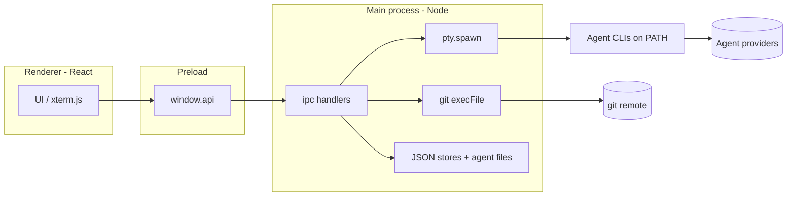

# AI Worktrees

A local macOS desktop app for managing AI coding-agent sessions across multiple git repositories. **Flight Deck** mode gives you a bird’s-eye view of every session; open any card into a fullscreen workspace with Neovim, the agent REPL, and a shell side by side. Each **worktree session** gets its own branch and worktree with long-lived embedded terminals — switch between repos and agents without losing context.

Built-in agents today: [Claude Code](https://claude.com/claude-code), Cursor Agent, Gemini CLI, and Codex CLI. The registry is data-driven; see [AGENTS-README.md](./AGENTS-README.md) to add another.

## Installing the latest version

Release artifacts are built from `main` in GitHub Actions. After copying the app to `/Applications`, you may need to clear quarantine for a locally built or downloaded build:

```sh
xattr -rd com.apple.quarantine "/Applications/AI Worktrees.app"
```

## Features

- **Flight Deck** (default view) — grid of all sessions with activity status, labels, and hover note previews; filter by working / idle / stopped or by label; open a fullscreen session workspace from any card.
- **Workspace view** — classic layout: sidebar session list, main agent terminal, and bottom dock (shell, Git, tasks, quick prompts).
- **Flight Deck session workspace** — fixed three-panel layout: embedded **Neovim** editor (top), **agent** REPL (bottom left), and **shell** terminal (bottom right); quick prompts and per-session notes in the top bar.
- **One-click new session** — pick an agent and repo, name the session; the app resolves the default branch, optionally `git fetch`, then `git worktree add` off `origin/main` or `origin/master`.
- **Session wizard** — optional questionnaire before create; answers compile into a markdown briefing you can paste into the agent terminal.
- **Global sessions** — run an agent at your whole code directory with no worktree or branch (useful for cross-repo work).
- **Embedded agent terminal** — xterm.js REPL per session via node-pty; sessions stay alive when you switch away.
- **Built-in shell** — fish shell when available (auto-installed via Homebrew on macOS/Linux at startup); otherwise your login shell. Used in the Flight Deck workspace and the Workspace bottom dock.
- **Neovim editor** — optional embedded editor per session with NERDTree, Go/JS tooling, and theme synced to app settings; config editable under Settings → Editor.
- **Session labels & notes** — color labels (including “Waiting On Review”), mute sessions from the card menu (muted sessions are skipped by **Shift+L**), and per-session notes with hover preview on Flight Deck cards.
- **Git panel** — status, diffs, stage / unstage / discard for the active worktree (Workspace view).
- **GitHub Stats** — Flight Deck modal aggregating merged PRs, commits, approvals, and review comments across your repos via `gh` (requires GitHub CLI sign-in).
- **Multi-repo, multi-agent** — sidebar groups sessions by repo; different sessions can use different agents concurrently.
- **Tasks kanban** — local task board persisted in app data (not tied to git).
- **Session quick prompts** — configurable paste-and-send shortcuts for the agent terminal.
- **Agent data** — per-agent instructions file editor, install detection, and billing / usage hints (Claude can show same-day cost via local `ccusage` data).
- **Settings import/export** — backup or migrate labels, prompts, editor config, wizard, and tasks as JSON.
- **Sessions persist across restarts** — worktrees and agent history survive app quit; reopen and continue (e.g. `claude --continue`).
- **Clean cleanup** — deleting a worktree session removes the worktree and can delete the branch.

### Keyboard shortcuts

| Shortcut | Action |
| --- | --- |
| **Shift+L** | Next session (skips muted) |
| **Shift+K** | Cycle panels in Flight Deck workspace (editor → agent → terminal) |
| **Shift+N** | Toggle session notes panel |
| **Shift+J** | Toggle NERDTree ↔ editor (Neovim only, in the embedded editor) |
| **Escape** | Close Flight Deck session workspace |

Full reference also appears on **Settings → Editor**.

## Requirements

- macOS
- Agent CLIs on your `PATH` for whichever agents you use (`claude`, `cursor-agent`, `gemini`, `codex`, …)
- **Neovim** (`nvim`) on `PATH` for the Flight Deck embedded editor (optional — other panels still work without it)
- A folder of git repos (default `$HOME/code`, configurable in Settings)
- Node.js 20+ and npm (development only; not required for a packaged `.app`)

On first launch the app may install **Git**, **GitHub CLI** (`gh`), and **fish** via Homebrew when missing (see [Security](#security)). GitHub Stats and automatic `gh` setup need `gh auth login`.

## Development

```sh
npm install      # also rebuilds node-pty for Electron
npm run dev      # launches Electron with HMR
```

If you change Node versions and node-pty stops loading, run `npm run rebuild`.

## Build & package

```sh
npm run dist     # produces release/AI Worktrees.dmg + .app
```

Drag the `.app` to `/Applications` and launch.

## Where things live

| What | Where |
| --- | --- |
| App data | `~/Library/Application Support/ai-worktrees/` when running from this repo (`npm run dev`), or `~/Library/Application Support/AI Worktrees/` for the packaged app. Legacy installs may have been migrated from `Claude Worktrees/` or `claude-worktrees-ui/` (see `src/main/migrate.ts`). |
| `sessions.json` | Session list (paths, agent, wizard brief, global flag, labels, notes, …) |
| `settings.json` | Code directory, theme, wizard config, tasks layout, session prompts, session labels, Neovim editor config |
| `diary.json` | Tasks kanban items |
| Worktrees | Sibling of the repo: `<parent>/<repo-name>-<session-name>` (slashes in the session name become dashes in the folder name) |

Wizard questions and the briefing template live in **settings** — updating the app does not overwrite a customized wizard until you use **Reset wizard to defaults** in Settings.

## Usage

### Flight Deck (default)

1. The **Flight Deck** grid shows every session as a card with activity, agent, labels, and a note preview on hover.
2. Filter by activity or label; use **GitHub Stats** for cross-repo contribution metrics (needs signed-in `gh`).
3. Click a card to open the **session workspace** — Neovim on top, agent and shell below.
4. Use **Shift+K** to move focus between panels; **Shift+N** for notes; quick prompts in the top bar send text to the agent REPL.
5. **Shift+L** jumps to the next non-muted session (closes the workspace and opens the next card).
6. Right-click a card for mute, labels, VS Code, Finder, or delete.

### Workspace view

Switch with the view toggle in the sidebar (**Flight Deck** / **Workspace**).

1. Click **+ New Session** in the sidebar.
2. Choose an agent (unavailable agents are greyed out if the CLI is not on `PATH`).
3. Optionally enable **Global session** to use the code directory instead of a repo worktree.
4. Pick a repo (for worktree sessions) and name the session (also the branch name for worktree sessions).
5. Leave **Use Wizard Mode** on to answer the briefing questionnaire, or off to create immediately.
6. The app creates the session and you can start the agent terminal from the main pane.
7. Use the bottom dock for a plain shell, the Git panel for changes, and the sidebar to switch sessions.
8. Hover a session and delete to remove it (worktree + optional branch for non-global sessions).

External shortcuts: **Open in VS Code**, **Reveal in Finder**, and agent instructions editing are under Agent Data and the session chrome.

## Security

This is a **local-first** app: no telemetry, no crash reporting, no in-app auto-update, and **no HTTP/HTTPS client code** in this repository. Network access happens only when **subprocesses you indirectly trigger** talk to the network (same class of behavior as using Terminal yourself).

### Trust model



You should treat the app as **fully trusted on your machine**: it can run shells, invoke `git`, read your code directory, and write its own config under Application Support.

### What the app does at runtime

| Action | What it touches |
| --- | --- |
| Lists repos | Reads directories under your configured code directory; `git rev-parse` per candidate |
| Creates a worktree session | `git fetch origin <branch>` when `origin` exists; `git worktree add` |
| Creates a global session | No git mutation; agent cwd is the code directory |
| Opens agent terminal | `pty.spawn` login shell running the agent CLI in the session cwd |
| Built-in shell | Separate `pty.spawn` per session at the same cwd; prefers **fish** when installed (`resolve-shell-path.ts`) |
| Flight Deck Neovim | `pty.spawn(nvim, …)` with app-managed config under userData (`nvim-config.ts`) |
| Git panel | `git status` / `diff` / `add` / `restore` / `clean` under the session worktree via `execFile` |
| GitHub Stats (Flight Deck) | `gh api graphql` via login shell; reads remotes from your repo paths — no first-party HTTP in app code |
| Persists state | `sessions.json`, `settings.json`, `diary.json` in userData |
| Deletes a worktree session | `git worktree remove`, optional `git branch -D` |
| Agent instructions | Read/write `~/…/<agent-home>/<instructions-file>` (paths from the in-code agent registry) |
| Claude usage chip | May run `npx` / `bun x` to invoke pinned `ccusage` (reads local Claude Code usage files; may hit npm registry to download the tool) |
| Startup dependency check | Probes/installs `git`, `gh`, and **fish** via Homebrew or winget when missing; may open Terminal for `gh auth login` |
| Open in VS Code | `code --reuse-window <path>` via `execFile` |
| Reveal in Finder | `shell.openPath` on the worktree directory |
| Open in Terminal | `osascript` telling macOS Terminal to `cd` into the worktree |

### Network and subprocesses

| Source | Can use the network? |
| --- | --- |
| This app’s TypeScript/JavaScript | **No** — no `fetch`, `http`, `axios`, etc. in `src/` |
| `git fetch` / `git` remote operations | **Yes** — uses your existing git credentials |
| Agent CLIs (Claude, Cursor, Gemini, Codex, …) | **Yes** — same as running them in Terminal |
| `gh` (install/auth check on startup; GitHub Stats) | **Yes** — when installed, during `gh auth`, or when fetching GraphQL stats |
| Homebrew / winget (optional install of git/gh/fish) | **Yes** — if automatic install runs |
| `npx ccusage@…` (Claude spend in Agent Data) | **Yes** — npm registry when the package is not already cached |
| `nvim` (Flight Deck editor) | **No** by itself — local editor only; plugins may network if you add them to the generated config |

### Filesystem scope

The app routinely reads or writes:

- Your **code directory** (repo scan, worktrees as siblings, global session cwd)
- **userData** JSON stores (sessions, settings, tasks)
- **Agent instruction files** under each agent’s home (e.g. `~/.claude/CLAUDE.md`)
- **Agent auth/usage files** for billing detection only (e.g. `~/.codex/auth.json`, Claude project dirs for `ccusage`) — not sent to a first-party server by this app
- Paths returned by **git** inside a worktree (status, diff, stage, discard)

It does **not** implement a sandbox around git or agents: anything those tools can access on disk, they can still access.

### Electron hardening

- `contextIsolation: true`, `nodeIntegration: false` — the renderer cannot call Node APIs directly.
- `sandbox: false` — required for node-pty; mitigation is a minimal `contextBridge` API only (`src/preload/index.ts`).
- All renderer → main calls go through typed IPC handlers in `src/main/ipc.ts`.
- Git uses `execFile('git', argv, { cwd })` — arguments are argv elements, not shell strings.
- Session names must match `^[a-zA-Z0-9._/-]+$` before branch or worktree paths are derived (`src/main/sessions.ts`).
- Built-in agent launch strings are **literal compositions** in `src/main/agents.ts` (no user text in the shell command). Agent binaries probed via `command -v` use names from the in-code `AGENTS` registry only.

**Shell usage (know the surface):**

- Agent PTYs: `pty.spawn($SHELL, ['-lic', '<command>'], { cwd })` — launch string from `agents.ts` literals only
- Built-in shell PTYs: `pty.spawn(resolvedShell, ['-l'], { cwd })` — fish preferred when available
- Neovim PTYs: `pty.spawn(nvim, …)` with fixed argv and app-written init config
- Agent detection: login shell running `command -v` for each registered binary
- macOS Terminal helper: `execFile('osascript', …)` with a `cd` into the worktree
- Legacy iTerm helper: `exec` + `osascript` (exposed on IPC but not used by current UI)
- GitHub CLI / fish setup: login shell for `brew` / `gh` / `fish` probes and installs
- GitHub Stats: `gh api graphql --input <tempfile>` (query written to `tmpdir`, not user content)

If the renderer were compromised (e.g. via a future XSS), IPC handlers that accept **paths** (`RevealInFinder`, `OpenInVSCode`, `OpenInTerminal`) could be abused to target arbitrary filesystem locations — today the UI only passes session paths from data the main process already stored.

### What the app does **not** do

- No first-party HTTP API, analytics, or update pings in source
- No cloud sync of sessions or settings
- No automatic upload of your code, prompts, or wizard answers

Agent providers are a separate trust boundary: whatever you type in a REPL is handled by that vendor’s CLI, exactly as in Terminal.

### Verify yourself

From the repository root:

```sh
# No in-app HTTP client
grep -rE 'fetch\(|http\.|https\.|axios|undici|net\.connect' src
# Expect: no matches

# Subprocess entry points (review manually)
grep -rE 'execFile|exec\(|pty\.spawn' src

# Session name validation
grep -n 'NAME_PATTERN' src/main/sessions.ts

# Electron webPreferences
grep -n 'contextIsolation\|nodeIntegration\|sandbox' src/main/index.ts
```

For contributor-level detail (adding agents, IPC, injection checklist), see [AGENTS-README.md § Security](./AGENTS-README.md#7-security).

## Architecture

```
src/
├── main/           Electron main process
│   ├── index.ts              window, lifecycle, migration
│   ├── ipc.ts                IPC handlers
│   ├── sessions.ts           session CRUD
│   ├── git.ts                worktree + status/diff/actions
│   ├── repos.ts              code-directory scan
│   ├── pty-manager.ts        agent PTY per session
│   ├── shell-pty-manager.ts  built-in shell PTY per session (fish preferred)
│   ├── nvim-pty-manager.ts   Neovim PTY per session (Flight Deck editor)
│   ├── nvim-config.ts        generated Neovim config in userData
│   ├── resolve-shell-path.ts fish / login-shell resolution
│   ├── fish-setup.ts         optional fish install at startup
│   ├── agents.ts             per-agent launch command
│   ├── agent-detection.ts    PATH probes (cached)
│   ├── agent-data.ts         instructions + billing/spend
│   ├── usage.ts              ccusage wrapper (Claude)
│   ├── gh-cli.ts             optional git/gh install + auth
│   ├── github-monitor.ts     GitHub Stats via gh GraphQL
│   ├── external-sessions.ts  discover agent processes outside the app
│   ├── settings.ts           settings store
│   ├── diary.ts              tasks store
│   ├── migrate.ts            legacy userData migration
│   ├── vscode.ts             VS Code CLI helper
│   └── store.ts              JSON read/write helper
├── preload/        contextBridge → window.api
├── renderer/       React + xterm.js UI (FlightDeck, Workspace, modals)
└── shared/         types, IPC channels, wizard, tasks, agents, nvim config
```

See [AGENTS-README.md](./AGENTS-README.md) for session lifecycle, adding an agent, and IPC conventions.
